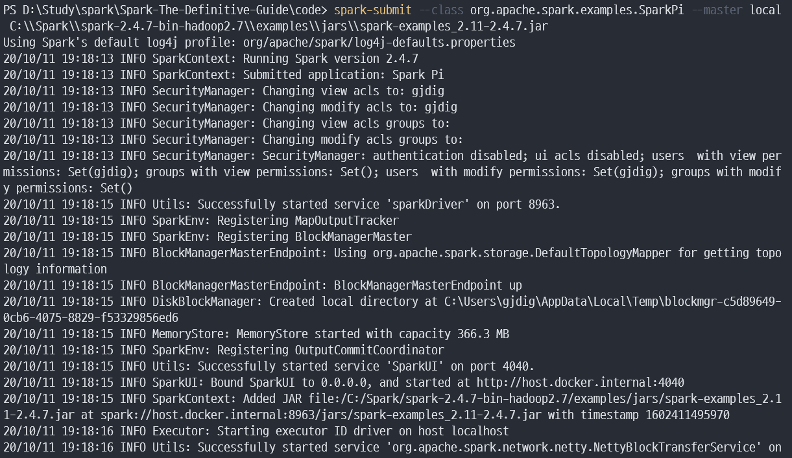

## 스파크의 기본 요소
+ 저수준 API
    + RDD
+ 구조적 API
    + Dataset
    + Dataframe
+ @추가기능(표준 라이브러리)

## 스파크 라이브러리
+ 그래프 분석
+ 머신러닝
+ 스트리밍

## spark-submit
+ 운영용 애플리케이션 실행
+ 예제로 제공되는 스칼라 애플리케이션 실행
    ```shell
    spark-submit \
        --class org.apache.spark.examples.SparkPi \
        --master local \
        C:\\Spark\\spark-2.4.7-bin-hadoop2.7\\examples\\jars\\spark-examples_2.11-2.4.7.jar
    ```
    실행한 모습
    
+ Configuration 우선순위
    1. code 내에서 정의한 설정
    2. spark-submit 에서 넣어주는 설정
    3. spark 폴더 내에 있는 설정파일에 적어둔 설정
+  --master 옵션을 조정해줌으로써 YARN이나 Kubernetes와 같은 클러스터 매니져에서 해당 애플리케이션을 수행할 수도 있다.
+  사용가능한 값 목록
    + local
    + local[N] (로컬모드에서 N개의 코어로 실행)
    + local[*] (로컬모드에서 현재 머신이 가지고 있는 만큼의 코어로 실행한다.)
    + yarn
    + k8s://<api_server_url>
+  --deploy-mode 옵션
    + cluster 모드 : Driver 자체가 마스터에서 실행되고 마스터 내부에서 실행된다.
    + client 모드 : Driver는 submit을 호출한 노드에서 실행된다.
+ [spark-submmit 공식 문서](https://spark.apache.org/docs/latest/submitting-applications.html)

## Dataset
+ Java나 Scala에서 사용하는 정적 데이터 타입을 지원하기 위한 API이다.
+ 파이썬이나 R과 같은 동적 데이터 타입언어는 사용할 수 없다. (필요도 없다!)
+ Comany dataset 예시
    ```scala
    case class Compnay(
        name: String,
        country: String,
        members: Int
    )
    ```
+ Comany dataset 사용 에시
    ```scala
    val iSeq = Seq(Company("Kakao", "대한민국", "100"), 
                Company("Naver", "대한민국", "100"), 
                Company("Google", "미국", "100"))
    val df = ss.sparkContext.parallelize(iSeq).toDF()

    val ds = df.as[Company] 
    ```

### 장점
+ 필요한 경우(DataFrame만으로 처리가 불가능할 때)에만 선택적으로 사용가능하다.
+ 스파크가 제공하는 함수들로 추가적인 처리가 가능하다. (고수준, 저수준 API 모두 적용가능)
+ `collect`나 `take` 메소드 호출시에 Row타입 객체가 아닌 Dataset에 지정한 타입의 객체를 반환한다.  

#### DataFrame
+ Row 타입의 객체로 구성된 [분산 컬렉션](https://spark.apache.org/docs/latest/rdd-programming-guide.html#parallelized-collections)
+ python 데이터 분석 패키지인 pandas의 DataFrame으로부터 spark의 DataFrame을 만들어낼 수도 있다.
    [(관련 문서)](https://docs.microsoft.com/ko-kr/azure/databricks/spark/latest/spark-sql/spark-pandas)
+ 기본 DataFrame은 `Dataset[Row]`를 가지고 생성됬다고 생각해도 무방하다.


#### Row 타입 객체
+ 다양한 데이터 타입의 테이블형 데이터를 보관 가능


## 구조적 스트리밍
+ 2.2버전 이상에서 사용 가능
+ 스트림 처리용 고수준 API
+ 일반 스트리밍
    + 적은 지연시간

### 장점
+ 구조적 API로 개발된 배치 모드의 연산을 스트리밍 방식으로 실행 가능
+ 계속해서 데이터가 쌓이는 상황에서 이벤트 시간에 따라 윈도우를 구성할 수 있다.

### 특징
+ 정적 데이터셋의 데이터를 분석해 DataFrame을 생성한다. (Dataset의 스키마도 함께 생성)
+ 스트리밍 연산 역시 지연 연산이므로 스트리밍 액션을 호출해야한다.
    + 스트리밍 액션은 다른 정적 액션들과는 다른 특성을 가진다.(추가해야할 부분)

## 저수준 API
+ 구조적 API와 다르게 세부적인 구현방식에서 차이가 보인다.
    + 파이썬과 스칼라에서 생성한 두 개의 RDD가 동일하지는 않다.
+ (구조적 API를 사용하는 것을 권장한다)